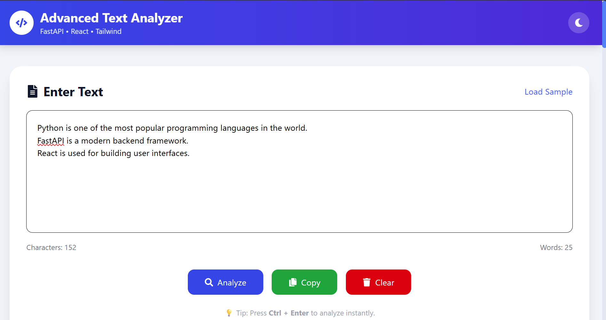
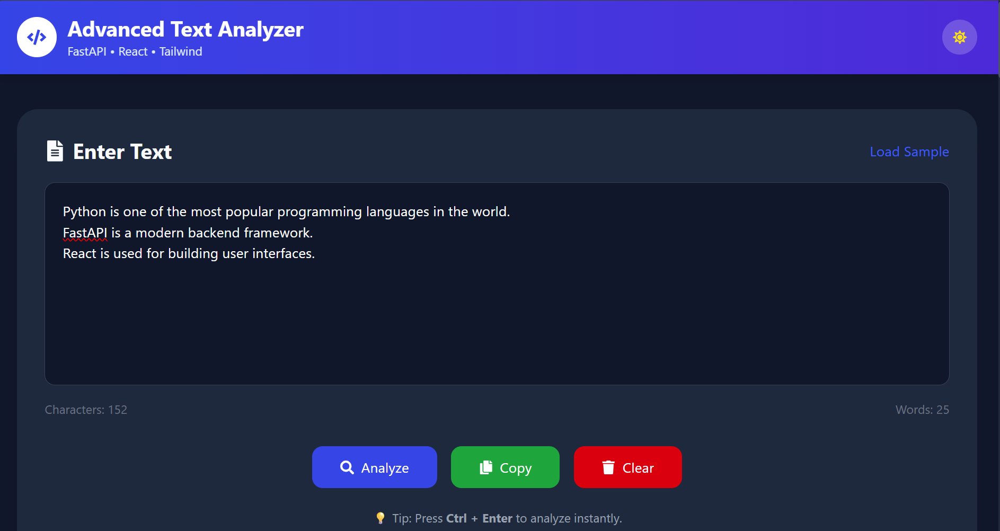
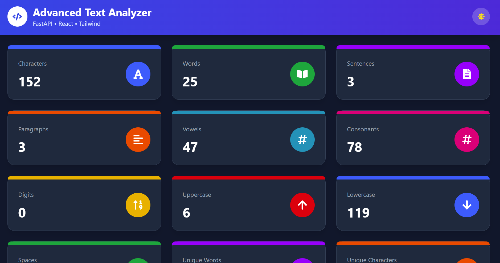
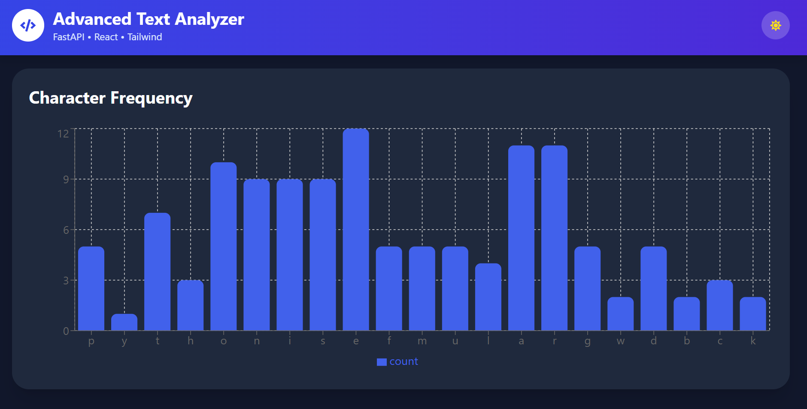
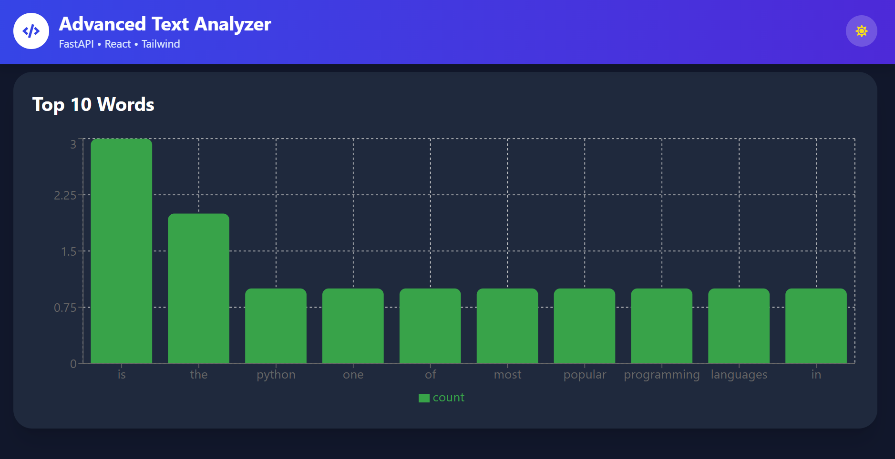
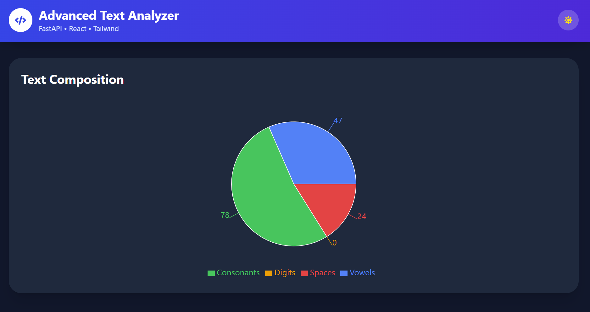
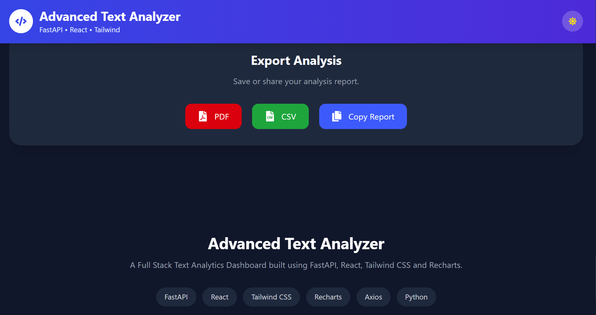

<div align="center">

# 📊 Advanced Text Analyzer

**A full-stack text analytics dashboard built with FastAPI, React, and Tailwind CSS.**

Paste any text and instantly get 23+ statistics, interactive charts, and exportable reports.

[](https://fastapi.tiangolo.com/)
[](https://react.dev/)
[](https://tailwindcss.com/)
[](https://python.org/)
[](LICENSE)
[](https://advanced-text-analyzer.vercel.app)
[](https://advanced-text-analyzer.onrender.com/docs)

**🌐 Live Demo:** [advanced-text-analyzer.vercel.app](https://advanced-text-analyzer.vercel.app)

**⚡ API Docs:** [advanced-text-analyzer.onrender.com/docs](https://advanced-text-analyzer.onrender.com/docs)

</div>

---

## ✨ Features

- **23+ Text Statistics** — characters, words, sentences, paragraphs, vowels, consonants, digits, unique words, reading time, speaking time, and more
- **Interactive Charts** — character frequency bar chart, top 10 words bar chart, text composition pie chart (powered by Recharts)
- **Export Reports** — download as PDF, CSV, or copy to clipboard
- **Dark Mode** — toggle between light and dark themes with localStorage persistence
- **Responsive Design** — works on desktop, tablet, and mobile
- **Live Character & Word Counter** — updates in real-time as you type
- **Keyboard Shortcut** — press `Ctrl + Enter` to analyze instantly

---

## 🛠️ Tech Stack

| Layer     | Technology                                      |
|-----------|-------------------------------------------------|
| Backend   | Python 3.10+, FastAPI 0.139, Uvicorn, Pydantic  |
| Frontend  | React 19, Vite, Tailwind CSS 4, Recharts        |
| HTTP      | Axios                                           |
| PDF       | jsPDF                                           |
| CSV       | file-saver                                      |
| Icons     | react-icons                                     |
| Toasts    | react-hot-toast                                 |

---

## 📁 Project Structure

```
Advanced-Text-Analyzer/
│
├── backend/
│   └── app/
│       ├── main.py                  # FastAPI app entry point
│       ├── routers/
│       │   ├── analyzer.py          # POST /analyzer/ endpoint
│       │   └── health.py            # GET  /health/ endpoint
│       ├── schemas/
│       │   ├── analyzer_schema.py   # Request & response models
│       │   └── response_schemas.py  # Generic API response wrapper
│       └── services/
│           └── text_service.py      # Core analysis logic
│
├── frontend/
│   └── src/
│       ├── api/
│       │   └── api.js               # Axios instance
│       ├── components/
│       │   ├── Navbar.jsx
│       │   ├── Footer.jsx
│       │   ├── TextInput.jsx        # Input area + analyze button
│       │   ├── StatsGrid.jsx        # 23-card stats grid
│       │   ├── StatCard.jsx         # Individual stat card
│       │   ├── Charts.jsx           # Bar + Pie charts
│       │   └── ExportToolbar.jsx    # PDF / CSV / Copy buttons
│       ├── context/
│       │   └── ThemeContext.jsx     # Dark mode context
│       ├── utils/
│       │   ├── pdfExport.js
│       │   └── csvExport.js
│       └── App.jsx
│
├── requirements.txt
└── README.md
```

---

## 🚀 Getting Started

### Prerequisites

- Python 3.10 or higher
- Node.js 18 or higher
- npm

---

### 1. Clone the Repository

```bash
git clone https://github.com/YOUR_GITHUB_USERNAME/Advanced-Text-Analyzer.git
cd Advanced-Text-Analyzer
```

---

### 2. Run the Backend

```bash
# Create and activate virtual environment
python -m venv venv

# Windows
venv\Scripts\activate

# macOS / Linux
source venv/bin/activate

# Install dependencies
pip install -r requirements.txt

# Start the server
uvicorn app.main:app --reload
```

Backend runs at: `http://127.0.0.1:8000`

---

### 3. Run the Frontend

```bash
cd frontend
npm install
npm run dev
```

Frontend runs at: `http://localhost:5173`

---

## 📡 API Reference

Base URL: `http://127.0.0.1:8000`

### `GET /`
Health check — returns a welcome message.

---

### `GET /health/`
Returns server status and version.

**Response:**
```json
{
  "status": "healthy",
  "version": "1.0.0"
}
```

---

### `POST /analyzer/`
Analyzes the provided text and returns 23+ statistics.

**Request Body:**
```json
{
  "text": "Your text goes here."
}
```

| Field | Type   | Required | Constraints          |
|-------|--------|----------|----------------------|
| text  | string | Yes      | 1–10,000 characters  |

**Response:**
```json
{
  "success": true,
  "message": "Text analyzed successfully.",
  "data": {
    "characters": 20,
    "words": 4,
    "sentences": 1,
    "paragraphs": 1,
    "vowels": 7,
    "consonants": 9,
    "digits": 0,
    "uppercase": 1,
    "lowercase": 15,
    "spaces": 3,
    "longest_word": "text",
    "shortest_word": "Your",
    "most_frequent_character": "o",
    "least_frequent_character": "y",
    "most_frequent_word": "your",
    "reverse_text": ".ereh seog txet ruoY",
    "palindrome": false,
    "reading_time": 0.02,
    "speaking_time": 0.03,
    "average_word_length": 3.75,
    "average_sentence_length": 4.0,
    "unique_words": 4,
    "unique_characters": 12,
    "punctuation_count": 1,
    "line_count": 1,
    "character_frequency": { "y": 1, "o": 2, ... },
    "word_frequency": { "your": 1, "text": 1, ... }
  }
}
```

Interactive API docs are available at: `http://127.0.0.1:8000/docs`

---

## 📊 Stats Analyzed

| Category         | Metrics                                                          |
|------------------|------------------------------------------------------------------|
| Basic Counts     | Characters, Words, Sentences, Paragraphs, Lines                  |
| Character Detail | Vowels, Consonants, Digits, Uppercase, Lowercase, Spaces         |
| Word Detail      | Longest Word, Shortest Word, Unique Words, Avg Word Length       |
| Frequency        | Most/Least Frequent Character, Most Frequent Word                |
| Readability      | Avg Sentence Length, Reading Time (200 WPM), Speaking Time (130 WPM) |
| Misc             | Unique Characters, Punctuation Count, Palindrome Check, Reverse Text |

---

## 🖥️ Screenshots

### Text Input — Light Mode

> Enter or paste text, see live character and word count, analyze with one click or `Ctrl + Enter`.

### Text Input — Dark Mode

> Full dark mode support with localStorage persistence across sessions.

### Stats Dashboard — Dark Mode

> 23 colorful stat cards with icons — characters, words, sentences, paragraphs, vowels, consonants, and more.

### Character Frequency Chart

> Bar chart showing how often each letter appears in the analyzed text.

### Top 10 Words Chart

> Bar chart of the 10 most frequently used words, sorted by count.

### Text Composition Pie Chart

> Pie chart breaking down vowels, consonants, digits, and spaces.

### Export Analysis

> Download the full report as PDF or CSV, or copy it to clipboard in one click.

---

## 🔮 Future Enhancements

- [ ] Upload TXT, PDF, and DOCX files for analysis
- [ ] Word Cloud visualization
- [ ] Readability Score (Flesch-Kincaid)
- [ ] Sentiment Analysis
- [ ] Keyword Extraction
- [ ] AI Summary (OpenAI / Groq)
- [ ] AI Grammar Correction
- [ ] AI Tone Detection
- [ ] Docker support
- [ ] CI/CD with GitHub Actions
- [ ] Deploy backend to Render
- [ ] Deploy frontend to Vercel

---

## 🤝 Contributing

Contributions are welcome. Please open an issue first to discuss what you'd like to change.

1. Fork the repository
2. Create a feature branch: `git checkout -b feature/your-feature`
3. Commit your changes: `git commit -m "Add your feature"`
4. Push to the branch: `git push origin feature/your-feature`
5. Open a Pull Request

---

## 📄 License

This project is licensed under the [MIT License](LICENSE).

---

<div align="center">

Made with ❤️ by **Swapnil Repale**

</div>
